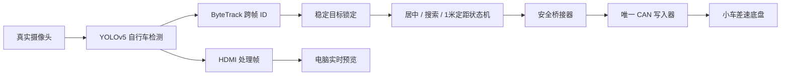

# 30TAI 自行车自动追踪完整工程

这是已经在 30TAI/ZG330、Icraft 3.33.1 环境实车验证的独立工程。它从真实摄像头检测自行车，自动控制小车完成目标搜索、画面居中和 1 米定距跟随，同时将处理画面实时传到电脑浏览器。

> 当前版本已集成 ByteTrack C++ 跟踪器。YOLOv5 仍只负责自行车检测，ByteTrack 在检测后维护跨帧 `track_id`，控制层只锁定一个稳定 ID；没有增加第二个神经网络模型。

## 已验证功能

- 真实摄像头输入和 HDMI 图像处理链路
- YOLOv5 `bicycle` 检测
- ByteTrack 跨帧 ID、低置信度二次匹配和短暂遮挡恢复
- 每辆自行车的 ID 显示在检测框内部，锁定目标为绿色，其他目标为黄色
- 原始轨迹在短时遮挡后重新编号时，会按位置和尺寸恢复遮挡前的显示 ID
- 多个自行车出现时保持当前锁定 ID，避免控制目标逐帧跳换
- 目标可见时自动小幅转向居中
- 连续丢失后按最后目标方向搜索，并周期性反向扫描
- 目标重新出现后立即退出搜索并恢复小幅追踪
- 单目距离估计、稳定滤波和 `1.00 m ± 0.05 m` 定距
- 差速控制：前进 `(+,+)`、后退 `(-,-)`、左转 `(-,+)`、右转 `(+,-)`
- 单一 CAN 写入器、模式 `0xAA`、反馈超时归零和命令脉冲限幅
- 云台控制关闭，避免底盘与云台 CAN 命令互相干扰
- 电脑端实时网页预览

最终实车验收值：目标中心约 `x=943`（画面中心 `x=960`），滤波距离约 `1.03 m`，稳定后电机命令自动回到 `0/0`。

## 工作流程



主程序始终使用 `AIM_FOLLOW_CAN_DRYRUN=1`，只计算控制量，不直接写 CAN。真正的 CAN 输出只经过 `safe_can_control_session.py`，因此不会出现两路 CAN 写入器互相抢占。

## 目录

```text
src/                         PLin + YOLOv5 + HDMI 主程序
aim_follow_control/          距离滤波、目标选择和控制状态机
bytetrack/                   ByteTrack、Kalman 和 LAPJV C++ 实现
configs/ZG/                  30TAI/ZG330 配置
imodel/ZG/                   已验证的 ZG 模型
prebuilt/ZG/                 3.33.1 aarch64 交叉编译二进制
tools/deploy_and_start.ps1    一键部署、启动和打开预览
tools/stop_all.ps1            一键归零并停止全部进程
tools/safe_*.py               CAN 唯一写入与安全桥接
start_vision_dryrun.sh        板端检测进程启动脚本
build_30tai.sh                3.33.1 低内存编译脚本
build_cross_3331.sh           电脑端 3.33.1 aarch64 交叉编译脚本
```

## 最快使用方式

### 1. 准备

- 板子运行 Icraft/SDK `3.33.1`
- 板子默认地址为 `192.168.125.171`
- 摄像头和 CAN 已连接
- 测试区域没有人员和障碍物
- 遥控器关闭，避免遥控模式和 CAN 模式竞争
- Windows 已安装 `ssh`、`scp`、`tar` 和 Python 3；Python 需要 Pillow：`pip install pillow`

### 2. 一键部署并启动

在本目录打开 PowerShell：

```powershell
powershell -ExecutionPolicy Bypass -File .\tools\deploy_and_start.ps1 `
  -BoardIp 192.168.125.171 `
  -BoardPassword "<板端密码>"
```

脚本会执行：

1. 停止旧的独立追踪进程并让电机归零。
2. 将预编译程序、模型、配置和工具部署到：
   `/home/fmsh/plin_pHdmi/examples/codex/plin_autonomous_bicycle_tracking`
3. 启动检测、CAN 安全会话和自动追踪。
4. 启动电脑端取帧与网页服务。
5. 打开 `http://127.0.0.1:8765/live_preview.html`。

## 停止

```powershell
powershell -ExecutionPolicy Bypass -File .\tools\stop_all.ps1 `
  -BoardIp 192.168.125.171 `
  -BoardPassword "<板端密码>"
```

停止顺序为：追踪桥接归零、检测停止、CAN 发送禁用帧、`can0` 关闭、电脑预览关闭。

## 重新编译

SHA-256 记录在 `SHA256SUMS.txt`。推荐在电脑 WSL/Linux 中使用 Icraft 3.33.1 aarch64 SDK 交叉编译，避免占用板子约 1 GB 的运行内存：

```bash
ICRAFT_SDK_ROOT=/home/ly/icraft_sdk/3.33.1-board \
DEPS_DIR=/mnt/c/Users/xushen/Desktop/hyx/30tai/fpai_demo_package_26010502/deps \
./build_cross_3331.sh
```

脚本会检查 ZG330 SDK 版本包含 `3.33.1.0`，并强制使用 `/usr/bin/aarch64-linux-gnu-g++`。输出文件为：

```text
build/cross-ZG/sdicamera+yolov5+hdmi
```

仅在完整的板端开发环境中需要原生编译时，才运行：

```bash
chmod +x build_30tai.sh
./build_30tai.sh
```

板端原生编译输出文件：

```text
build/ZG/sdicamera+yolov5+hdmi
```

板端内存约 1 GB 时，原生脚本会建立 2 GB 交换文件并使用 `-j1` 编译。任一种方式编译完成后，将新文件替换到 `prebuilt/ZG/sdicamera+yolov5+hdmi`，更新 `SHA256SUMS.txt`，再运行一键部署脚本。

## 当前控制参数

| 参数 | 值 |
|---|---:|
| 目标距离 | `1.00 m` |
| 距离停止范围 | `0.95–1.05 m` |
| 可见目标转速上限 | `35 rpm` |
| 丢失搜索转速 | `40 rpm` |
| 搜索确认延迟 | `0.35 s` |
| 搜索换向周期 | `60` 检测帧 |
| 距离焦距标定 | `544 px`（640 宽模型坐标） |
| 目标实际宽度 | `0.24 m` |
| CAN 波特率 | `250000` |

## 安全约束

- 第一次在新板上运行时应架空车轮或保证四周空旷。
- 不要同时运行其他 CAN 控制程序。
- 检测日志超过 `0.35 s` 没有更新，桥接器自动归零。
- CAN 反馈超过 `0.30 s` 没有更新，唯一写入器自动归零。
- 搜索与追踪命令分别硬限制为 `40 rpm` 和 `35 rpm`。
- `stop_all.ps1` 是正常停止入口；紧急情况应同时断开底盘动力。

## 测试

桥接器逻辑测试：

```bash
python3 -m unittest tools/test_safe_tracking_bridge.py
```

控制器测试：

```bash
cmake -S aim_follow_control -B aim_follow_control/build
cmake --build aim_follow_control/build
./aim_follow_control/build/aim_follow_controller_test
```

## ByteTrack 的关系

ByteTrack 位于“YOLOv5 自行车检测”和“控制目标选择”之间。默认参数针对当前模型约 `0.5` 的常见自行车置信度调整为：建轨阈值 `0.30`、新轨确认阈值 `0.45`、匹配阈值 `0.80`。画面会显示锁定目标的 `ByteTrack ID`。

可用环境变量：

| 参数 | 默认值 | 说明 |
|---|---:|---|
| `AIM_FOLLOW_BYTETRACK_ENABLE` | `1` | `0` 时退回原连续目标选择器 |
| `AIM_FOLLOW_BYTETRACK_FRAME_RATE` | `30` | 跟踪器时间尺度 |
| `AIM_FOLLOW_BYTETRACK_BUFFER_FRAMES` | `90` | 丢失轨迹和显示 ID 的保留帧数（30 FPS 时约 3 秒） |
| `AIM_FOLLOW_BYTETRACK_SWITCH_DELAY_FRAMES` | `3` | 当前 ID 丢失后允许切换目标的等待帧数 |
| `AIM_FOLLOW_BYTETRACK_TRACK_THRESH` | `0.30` | 高/低置信度检测分界 |
| `AIM_FOLLOW_BYTETRACK_HIGH_THRESH` | `0.45` | 新建轨迹最低置信度 |
| `AIM_FOLLOW_BYTETRACK_MATCH_THRESH` | `0.80` | 第一阶段关联阈值 |
