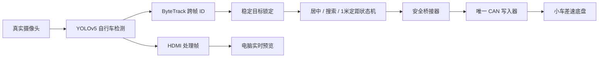

# 30TAI 自行车自动追踪完整工程

这是已经在 30TAI/ZG330、Icraft 3.33.1 环境实车验证的独立工程。它从真实摄像头检测自行车，自动控制小车完成目标搜索、画面居中和 1 米定距跟随，同时将处理画面实时传到电脑浏览器。

> 当前版本已集成 ByteTrack C++ 跟踪器。YOLOv5 仍只负责自行车检测，ByteTrack 在检测后维护跨帧 `track_id`，控制层只锁定一个稳定 ID；没有增加第二个神经网络模型。

## 已验证功能

- 真实摄像头输入和 HDMI 图像处理链路
- YOLOv5 `bicycle` 检测
- ByteTrack 跨帧 ID、低置信度二次匹配和短暂遮挡恢复
- 每辆自行车的 ID 显示在检测框内部，锁定目标为绿色，其他目标为黄色
- 原始轨迹在短时遮挡后重新编号时，会按位置和尺寸恢复遮挡前的显示 ID
- 目标居中且小车停止后，云台固定水平轴 `yaw=123`，只用俯仰轴在 `120–180` 上下粗搜
- 找到红外点后进入双轴精调，水平和俯仰每次最多改变 `2`，直到光点落到目标中心
- 板端使用未叠加文字的原始帧做云台动作前后差分，适配当前摄像头中呈近白色的红外光点
- 多个自行车出现时保持当前锁定 ID，避免控制目标逐帧跳换
- 目标可见时自动小幅转向居中
- 连续丢失后按最后目标方向搜索，并周期性反向扫描
- 目标重新出现后立即退出搜索并恢复小幅追踪
- 单目距离估计、稳定滤波，以及 `±0.01 m` 停车、超过 `±0.05 m` 才恢复的定距滞回
- 差速控制：前进 `(+,+)`、后退 `(-,-)`、左转 `(-,+)`、右转 `(+,-)`
- 单一 CAN 写入器、模式 `0xAA`、反馈超时归零和命令脉冲限幅
- 底盘与云台分阶段启用并共用唯一 CAN 写入器，避免两路 CAN 命令互相干扰
- 电脑端实时网页预览

最终实车验收值：目标中心约 `x=943`（画面中心 `x=960`），滤波距离约 `1.03 m`，稳定后电机命令自动回到 `0/0`。

2026-07-13 实车闭环：ByteTrack 连续保持 `locked_id=1 / selected_id=1`；目标横坐标从 `x=266` 移到中心区后转向归零。以现场 `1.40 m` 重新标定距离后，滤波距离在 `0.99296 m` 进入 `±0.01 m` 停车区；随后检测框波动使距离稳定在 `1.01424 m`，`±0.05 m` 恢复滞回保持电机命令为 `0/0`。最终目标中心约 `x=1013`，每段测试结束后 `can0` 均验证为 `DOWN`，云台、红外和丢失搜索保持关闭。

## 工作流程



默认底盘追踪路径中，主程序使用 `AIM_FOLLOW_CAN_DRYRUN=1`，只计算控制量，不直接写 CAN。真正的 CAN 输出只经过 `safe_can_control_session.py`，因此不会出现两路 CAN 写入器互相抢占。

## 目录

```text
src/                         PLin + YOLOv5 + HDMI 主程序
aim_follow_control/          距离滤波、目标选择和控制状态机
bytetrack/                   ByteTrack、Kalman 和 LAPJV C++ 实现
configs/ZG/                  30TAI/ZG330 配置
imodel/ZG/                   已验证的 ZG 模型
prebuilt/ZG/                 3.33.1 aarch64 交叉编译二进制
tools/deploy_and_start.ps1    一键部署、启动和打开预览
tools/stop_all.ps1            一键归零并停止全部进程
tools/safe_*.py               CAN 唯一写入与安全桥接
start_vision_dryrun.sh        板端检测进程启动脚本
start_chassis_tracking_test.sh 仅底盘、单一安全 CAN 写入器的限时闭环测试
start_laser_aim_test.sh       底盘锁止的云台红外瞄准测试脚本
start_tracking_test.sh         带显式解锁、限速和自动归零的实车测试脚本
build_30tai.sh                3.33.1 低内存编译脚本
build_cross_3331.sh           电脑端 3.33.1 aarch64 交叉编译脚本
```

## 最快使用方式

### 1. 准备

- 板子运行 Icraft/SDK `3.33.1`
- 板子默认地址为 `192.168.125.171`
- 摄像头和 CAN 已连接
- 测试区域没有人员和障碍物
- 遥控器关闭，避免遥控模式和 CAN 模式竞争
- Windows 已安装 `ssh`、`scp`、`tar` 和 Python 3；Python 需要 Pillow：`pip install pillow`

### 2. 一键部署并自动追踪

在本目录打开 PowerShell：

```powershell
powershell -ExecutionPolicy Bypass -File .\tools\deploy_and_start.ps1 `
  -BoardIp 192.168.125.171 `
  -BoardPassword "<板端密码>"
```

弱红外点需要更强的软件增强时，可在命令末尾增加 `-IrGain 6`；默认值为 `4`。电脑预览的候选筛选参数可以分别调整：

| 部署参数 | 默认值 | 作用 |
|---|---:|---|
| `-IrRedMin` | `180` | RGB 红通道最低值 |
| `-IrRedDominance` | `50` | 红通道必须比绿/蓝通道至少高出的值；调高可排除黄色标签和普通红物体 |
| `-IrReflectionMax` | `200` | 绿/蓝竞争通道上限；调低可排除白色或黄色强反光 |
| `-IrLocalContrast` | `8` | 光点相对周围背景的最低反差；调高可排除平坦色块 |
| `-IrReference` | 空 | 红外关闭参考帧；设置后网页使用关闭/打开差分模式 |

脚本会执行：

1. 停止旧的独立追踪进程并让电机归零。
2. 将预编译程序、模型、配置和工具部署到：
   `/home/fmsh/plin_pHdmi/examples/codex/plin_main_current`
3. 启动检测并自动建立唯一的安全 CAN 会话；收到 `0xAA` 模式反馈后，启动 ByteTrack 低速底盘追踪。
4. 启动电脑端取帧与网页服务。
5. 打开 `http://127.0.0.1:8765/live_preview.html`。

默认部署完成后即可追踪，不需要再输入开启 CAN 的命令。追踪上限为 `35 rpm`，云台、红外和丢失搜索保持关闭；目标日志或 CAN 反馈中断时自动归零。只需要无动作预览时增加 `-PreviewOnly`：

```powershell
powershell -ExecutionPolicy Bypass -File .\tools\deploy_and_start.ps1 `
  -BoardIp 192.168.125.171 `
  -BoardPassword "<板端密码>" `
  -PreviewOnly
```

网页会同步显示两路画面：左侧是板端检测结果，右侧是电脑端红外增强结果。传入 `-IrReference` 后，右侧比较当前帧与同一场景的“红外关闭”帧，并屏蔽顶部状态栏、紫色检测框及其文字标签；当前标定要求红点相对关闭帧新增红色差分、红通道高于绿通道、面积至少 `30` 像素。整幅画面保持灰度，只把唯一候选点显示成红色。红外关闭时应显示 `IR: NONE`；弱光点短时低于阈值时会在原位置保持 6 帧，状态栏显示 `IR: DETECTED`、`IR: HELD` 或 `IR: NONE`。

两路画面共用同一帧编号，只有都加载完成后才一起刷新，因此不会把旧候选图和新检测图混在一起。默认增强增益为 `4`，手动运行预览工具时可用 `--ir-gain 6` 调高。

普通 RGB 摄像头无法仅凭单帧颜色从物理上完全区分可见红光和红外光。本机实测红外点约为 `RGB=250/234/242`，视觉上接近白色，因此板端默认不用静态 RGB 阈值，而是在每次云台小步动作前保存原始参考帧，动作后等待 1 帧并在最多 4 帧内寻找新增紧凑光点。需要进一步消除同波段反光时，应给摄像头增加与红外发射器波长匹配的窄带滤光片，或让发射器按已知频率调制后做同步检测。

### 红外关闭/打开标定

更换摄像头、红外发射器或现场光照后，保持相机和目标不动，分别保存红外关闭帧与打开帧，然后运行：

```powershell
python .\tools\calibrate_ir_thresholds.py `
  --off .\runtime\ir_calibration\ir_off.jpg `
  --on .\runtime\ir_calibration\ir_on.jpg `
  --json-out .\runtime\ir_calibration\ir_thresholds.json `
  --preview-out .\runtime\ir_calibration\ir_calibration_preview.jpg
```

工具只分析打开后新增的紧凑红色光点，忽略顶部状态栏、紫色检测框和黄色 ID 标签，输出建议的 `ir_red_min`、`ir_red_dominance`、`ir_reflection_max` 与 `ir_local_contrast`。校验图会把整幅图转为灰度，仅将选中的真实变化点标成红色；应用参数前必须先检查标记位置确实是红外点。

手动启动网页差分预览时，将关闭帧传给预览工具：

```powershell
python .\tools\preview_plin_network_frames.py `
  --target root@192.168.125.171 `
  --remote-dir /home/fmsh/plin_pHdmi/examples/codex/plin_main_current `
  --out-dir .\runtime\network_preview `
  --seconds 7200 `
  --ir-reference .\runtime\ir_calibration\ir_off.jpg
```

## 停止

```powershell
powershell -ExecutionPolicy Bypass -File .\tools\stop_all.ps1 `
  -BoardIp 192.168.125.171 `
  -BoardPassword "<板端密码>"
```

停止顺序为：追踪桥接归零、检测停止、CAN 发送禁用帧、`can0` 关闭、电脑预览关闭。

## 分阶段实车测试

先运行无动作预览，确认检测框、ByteTrack ID、距离和 `Laser:WAIT_CENTER` 状态正确：

```bash
./start_vision_dryrun.sh
```

场地清空、遥控器关闭并确认只有一个 CAN 写入器后，先把目标人工放到画面中央，打开红外，只测试云台瞄准。此阶段底盘被硬关闭：

```bash
ARM_REAL_CAN=YES AREA_CLEAR=YES IR_READY=YES RUN_SECONDS=45 \
./start_laser_aim_test.sh
```

确认日志依次出现 `COARSE_SEARCH`、`FINE_AIM`、`LOCKED`，并观察到粗搜只上下移动、找到光点后才双轴微调。随后第二阶段只启用小车低速追踪，云台保持关闭：

```bash
ARM_REAL_CAN=YES AREA_CLEAR=YES RUN_SECONDS=5 \
ENABLE_CHASSIS=1 ENABLE_GIMBAL=0 ENABLE_LASER=0 \
./start_tracking_test.sh
```

上述底盘命令会自动转入 `start_chassis_tracking_test.sh`：主视觉程序固定为 `CAN_DRYRUN`，仅 `safe_can_control_session.py` 写 CAN；运行时限必须在 `0–30 s` 内。目标丢失、日志超时、反馈不是 `0xAA` 或脚本退出都会归零并关闭 `can0`。

确认小车能够把锁定目标移到画面中央并稳定在约 1 米后，第三阶段联调底盘和红外瞄准。云台只在小车电机命令为 `0/0` 且目标连续居中后启动：

```bash
ARM_REAL_CAN=YES AREA_CLEAR=YES IR_READY=YES RUN_SECONDS=120 \
ENABLE_CHASSIS=1 ENABLE_GIMBAL=1 ENABLE_LASER=1 \
./start_tracking_test.sh
```

红外状态依次为：`WAIT_CENTER`（等待小车居中）、`COARSE_SEARCH`（水平固定 `123`，只上下扫描俯仰）、`FINE_AIM`（找到红点后同时微调水平和俯仰，每轴单次最多 `2`）、`LOCKED`（红点稳定指向目标中心）。真实测试脚本默认关闭目标丢失后的底盘搜索，测试结束后发送零速/禁用帧并关闭 `can0`。

实车脚本使用独立时限看门狗，不依赖主进程退出状态；到达 `RUN_SECONDS` 后必定发送底盘 `0/0`、禁用帧并将 `can0` 置为 `DOWN`。`start_vision_dryrun.sh` 也会在启动检测前显式关闭 `can0`。

## 重新编译

SHA-256 记录在 `SHA256SUMS.txt`。推荐在电脑 WSL/Linux 中使用 Icraft 3.33.1 aarch64 SDK 交叉编译，避免占用板子约 1 GB 的运行内存：

```bash
ICRAFT_SDK_ROOT=/home/ly/icraft_sdk/3.33.1-board \
DEPS_DIR=/mnt/c/Users/xushen/Desktop/hyx/30tai/fpai_demo_package_26010502/deps \
./build_cross_3331.sh
```

脚本会检查 ZG330 SDK 版本包含 `3.33.1.0`，并强制使用 `/usr/bin/aarch64-linux-gnu-g++`。输出文件为：

```text
build/cross-ZG/sdicamera+yolov5+hdmi
```

仅在完整的板端开发环境中需要原生编译时，才运行：

```bash
chmod +x build_30tai.sh
./build_30tai.sh
```

板端原生编译输出文件：

```text
build/ZG/sdicamera+yolov5+hdmi
```

板端内存约 1 GB 时，原生脚本会建立 2 GB 交换文件并使用 `-j1` 编译。任一种方式编译完成后，将新文件替换到 `prebuilt/ZG/sdicamera+yolov5+hdmi`，更新 `SHA256SUMS.txt`，再运行一键部署脚本。

## 当前控制参数

| 参数 | 值 |
|---|---:|
| 目标距离 | `1.00 m` |
| 距离停车范围 | `0.99–1.01 m` |
| 距离恢复阈值 | 偏差超过 `±0.05 m` |
| 可见目标转速上限 | `35 rpm` |
| 丢失搜索转速 | `40 rpm` |
| 搜索确认延迟 | `0.35 s` |
| 搜索换向周期 | `60` 检测帧 |
| 距离焦距标定 | `600 px`（640 宽模型坐标；现场 `1.40 m` 标定） |
| 距离稳定阈值 | `0.01 m`（抑制检测框微小抖动，同时保留真实距离变化） |
| 目标实际宽度 | `0.24 m` |
| CAN 波特率 | `250000` |
| 红外粗搜 yaw | 固定 `123`（小车正前方） |
| 红外粗搜 pitch 范围 | `120–180` |
| 红外精调 yaw 范围 | `100–165` |
| 红外精调 pitch 范围 | `120–180` |
| 红外精调单步上限 | `2` |

## 安全约束

- 第一次在新板上运行时应架空车轮或保证四周空旷。
- 不要同时运行其他 CAN 控制程序。
- 检测日志超过 `0.35 s` 没有更新，桥接器自动归零。
- CAN 反馈超过 `0.30 s` 没有更新，唯一写入器自动归零。
- 搜索与追踪命令分别硬限制为 `40 rpm` 和 `35 rpm`。
- `stop_all.ps1` 是正常停止入口；紧急情况应同时断开底盘动力。

## 测试

桥接器逻辑测试：

```bash
python3 -m unittest tools/test_safe_tracking_bridge.py
```

控制器测试：

```bash
cmake -S aim_follow_control -B aim_follow_control/build
cmake --build aim_follow_control/build
./aim_follow_control/build/aim_follow_controller_test
```

## ByteTrack 的关系

ByteTrack 位于“YOLOv5 自行车检测”和“控制目标选择”之间。默认参数针对当前模型约 `0.5` 的常见自行车置信度调整为：建轨阈值 `0.30`、新轨确认阈值 `0.45`、匹配阈值 `0.80`。画面会显示锁定目标的 `ByteTrack ID`。

可用环境变量：

| 参数 | 默认值 | 说明 |
|---|---:|---|
| `AIM_FOLLOW_BYTETRACK_ENABLE` | `1` | `0` 时退回原连续目标选择器 |
| `AIM_FOLLOW_BYTETRACK_FRAME_RATE` | `30` | 跟踪器时间尺度 |
| `AIM_FOLLOW_BYTETRACK_BUFFER_FRAMES` | `90` | 丢失轨迹和显示 ID 的保留帧数（30 FPS 时约 3 秒） |
| `AIM_FOLLOW_BYTETRACK_SWITCH_DELAY_FRAMES` | `3` | 当前 ID 丢失后允许切换目标的等待帧数 |
| `AIM_FOLLOW_BYTETRACK_TRACK_THRESH` | `0.30` | 高/低置信度检测分界 |
| `AIM_FOLLOW_BYTETRACK_HIGH_THRESH` | `0.45` | 新建轨迹最低置信度 |
| `AIM_FOLLOW_BYTETRACK_MATCH_THRESH` | `0.80` | 第一阶段关联阈值 |

## 红外瞄准参数

| 参数 | 默认值 | 说明 |
|---|---:|---|
| `AIM_FOLLOW_LASER_AIM_ENABLE` | `0` | 启用红点闭环瞄准；安全预览脚本会在 DRYRUN 中设为 `1` |
| `AIM_FOLLOW_LASER_CENTER_GATE_NORM` | `0.08` | 允许云台启动的目标水平居中误差 |
| `AIM_FOLLOW_LASER_MIN_YAW` / `MAX_YAW` | `100` / `165` | 精调 yaw 安全范围；粗搜固定在编译标定值 `123` |
| `AIM_FOLLOW_LASER_MIN_PITCH` / `MAX_PITCH` | `120` / `180` | 粗搜和精调 pitch 安全范围 |
| `AIM_FOLLOW_LASER_COARSE_YAW_ENABLE` | `0` | `0` 表示粗搜不动水平轴 |
| `AIM_FOLLOW_LASER_COARSE_PITCH_STEP` | `5` | 粗搜 pitch 步长 |
| `AIM_FOLLOW_LASER_COARSE_MOTION_PX` | `4` | 红点随云台变化的最小确认位移 |
| `AIM_FOLLOW_LASER_FINE_YAW_ENABLE` | `1` | 找到红点后允许水平轴参与精调 |
| `AIM_FOLLOW_LASER_FINE_MAX_STEP` | `2` | 精调时单帧最大控制步长 |
| `AIM_FOLLOW_LASER_FINE_DEADZONE_NORM` | `0.015` | 红点与目标中心的锁定死区 |
| `AIM_FOLLOW_LASER_INVERT_YAW` / `INVERT_PITCH` | `0` / `0` | 实车标定时反转对应轴方向 |
| `AIM_FOLLOW_LASER_MOTION_ENABLE` | `1` | 使用云台动作前后原始帧差分；当前摄像头必须保持开启 |
| `AIM_FOLLOW_LASER_MOTION_DELTA_MIN` / `LOCAL_MIN` | `6` / `3` | 新增红通道差分和局部差分阈值 |
| `AIM_FOLLOW_LASER_MOTION_MIN_AREA` / `MAX_AREA` | `2` / `160` | 板端原始帧光点面积范围 |
| `AIM_FOLLOW_LASER_MOTION_MAX_SPAN` | `24` | 光点最大宽度或高度 |
| `AIM_FOLLOW_LASER_MOTION_SETTLE_FRAMES` | `1` | 云台命令后跳过的稳定帧数 |
| `AIM_FOLLOW_LASER_MOTION_SAMPLE_FRAMES` | `4` | 每次云台动作后的最大查找帧数 |
| `AIM_FOLLOW_LASER_MOTION_HOLD_FRAMES` | `6` | 检出后允许短时保持的帧数 |
| `AIM_FOLLOW_LASER_RED_MIN` | `250` | 红点最低红通道亮度 |
| `AIM_FOLLOW_LASER_RED_DOMINANCE` | `130` | 红通道相对蓝/绿通道的最低优势 |
| `AIM_FOLLOW_LASER_REFLECTION_MAX` | `200` | 蓝/绿竞争通道上限；超过时按白色/黄色强反光排除 |
| `AIM_FOLLOW_LASER_LOCAL_CONTRAST` | `20` | 候选点相对周围局部背景的最低亮度反差，用于抑制大片红色物体 |
| `AIM_FOLLOW_LASER_DEBUG_VIEW` | `0` | 在板端检测画面内显示小型红色差分热力图；网页已有独立增强画面，通常保持关闭 |
| `AIM_FOLLOW_LASER_DEBUG_GAIN` | `4` | 板端调试热力图增益，不影响网页的 `--ir-gain` |
